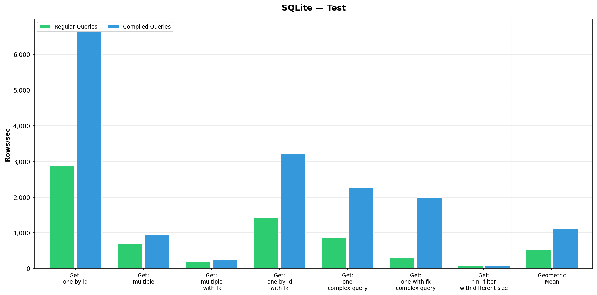
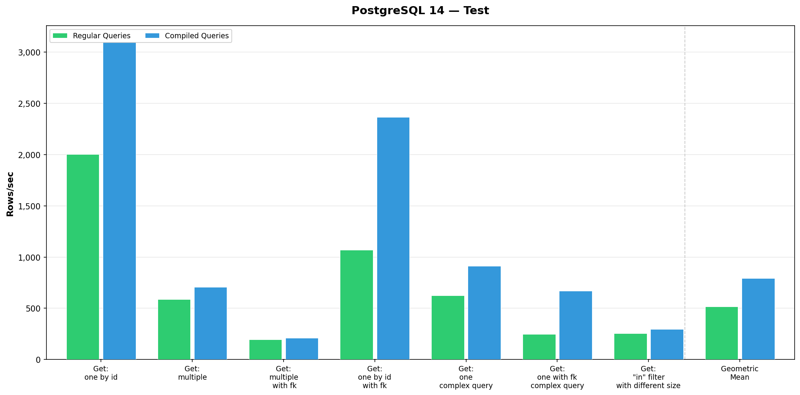
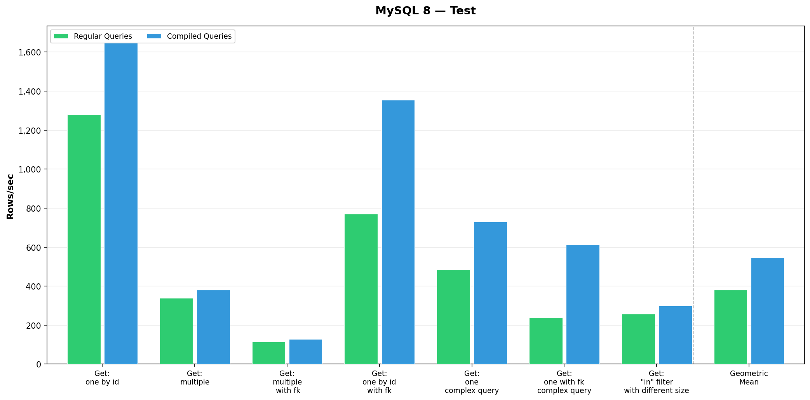

### Running benchmarks
If you just want to run benchmarks:
```shell
uv sync
uv run -m bench
```

If you want to generate chart:
```shell
uv sync
uv run -m bench regular >/tmp/sqlite_outfile1
uv run -m bench prepared >>/tmp/sqlite_outfile1
```

### Generating charts
```shell
uv run generate_charts.py
```

Benchmark results for [ebd33cb](https://github.com/RuslanUC/tortoise-orm/commit/ebd33cbe56335afd6e42cb9cd80f89076afba558):



